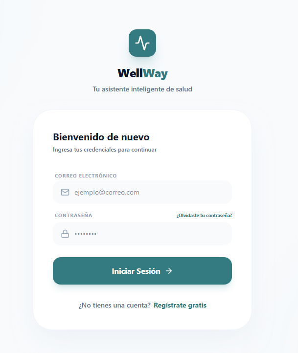
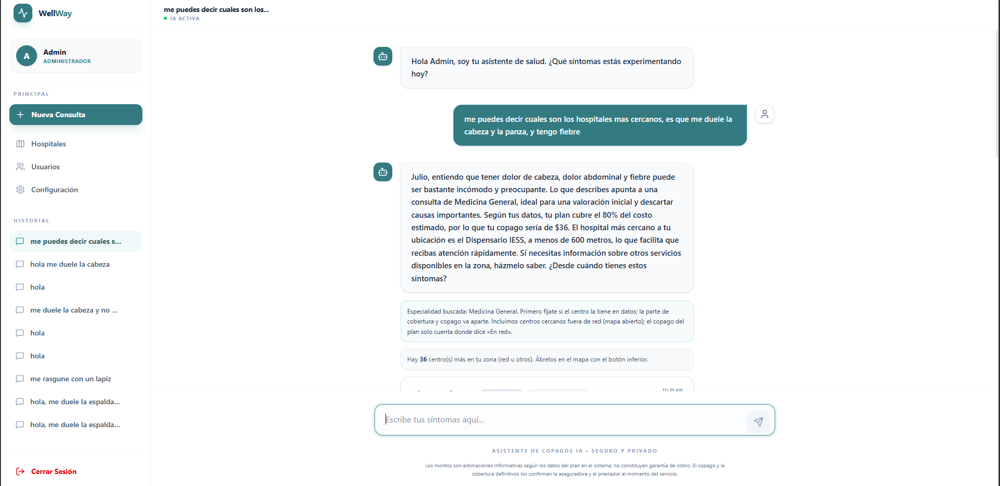
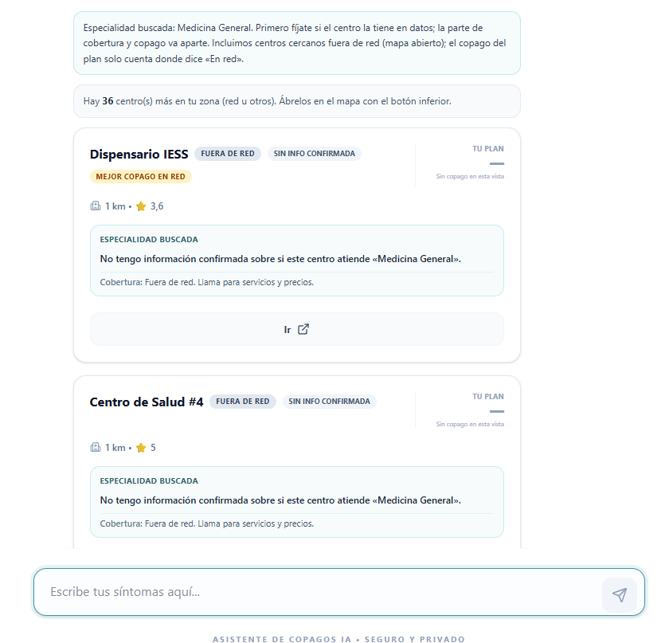
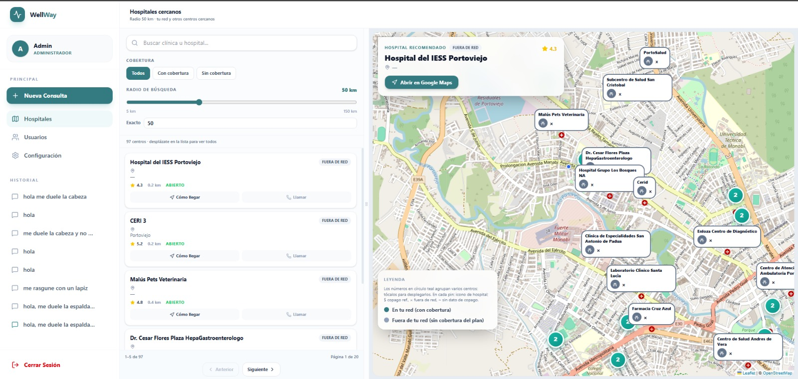
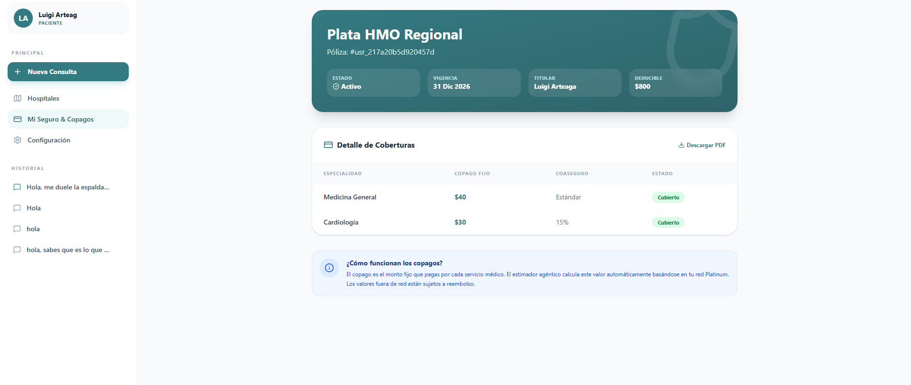
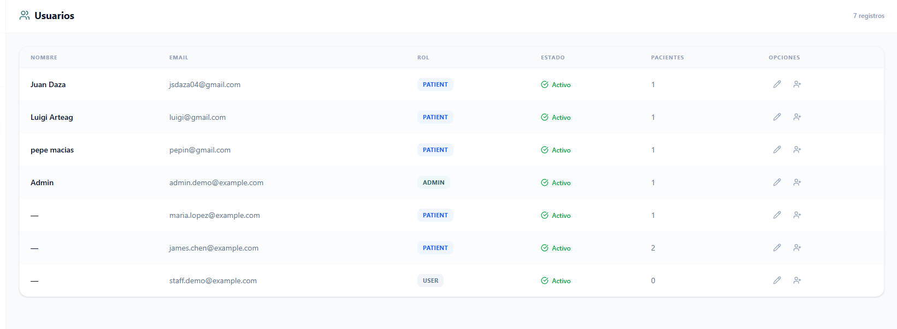

# WellWay — Guía de Acceso y Funcionalidades Principales

## ¿Qué es WellWay?

**WellWay** es un asistente inteligente de salud orientado a pacientes con seguro médico. Permite consultar síntomas a través de un chat con IA, estimar copagos según el plan del usuario, encontrar hospitales dentro y fuera de la red de cobertura, y visualizar los detalles del seguro en tiempo real. Existe también un rol de administrador para gestionar usuarios y pacientes del sistema.

---

## Credenciales de Acceso

### Rol: Paciente

| Campo       | Valor                        |
|-------------|------------------------------|
| **Correo**  | `luigi@gmail.com`       |
| **Contraseña** | `123456`               |

### Rol: Administrador

| Campo       | Valor                        |
|-------------|------------------------------|
| **Correo**  | `admin.demo@example.com`          |
| **Contraseña** | `123456`               |

---

## Pasos para usar el sistema

### 1. Inicio de sesión

1. Abre la aplicación en el navegador.
2. Ingresa el **correo electrónico** y la **contraseña** del rol que deseas revisar.
3. Haz clic en **Iniciar Sesión**.

---

### 2. Chat con el Asistente de IA (rol Paciente)

1. Después de iniciar sesión, se abre automáticamente la vista de **Chat**.
2. Escribe tus síntomas en el campo de texto (ej. *"me duele la cabeza y tengo fiebre"*).
3. El asistente responde con una estimación de copago y te muestra hospitales de la red cercanos a tu ubicación.
4. Puedes iniciar una **Nueva Consulta** desde el panel lateral izquierdo.

---

### 3. Mapa de Hospitales (rol Paciente)

1. En el menú lateral, selecciona **Hospitales**.
2. Se muestra un mapa interactivo con los centros de salud cercanos.
3. Los hospitales **en red** (con cobertura de tu seguro) aparecen destacados.
4. Puedes buscar por nombre, ver distancia, copago estimado y obtener direcciones.

---

### 4. Mi Seguro y Copagos (rol Paciente)

1. En el menú lateral, selecciona **Mi Seguro & Copagos**.
2. Se despliega el detalle del plan contratado: deducible anual, coaseguro, tope de bolsillo.
3. Se lista cada especialidad cubierta con su copago fijo correspondiente.
4. Puedes descargar un resumen en **PDF** con el botón de descarga.

---

### 5. Panel de Administrador (rol Administrador)

1. Inicia sesión con las credenciales de administrador.
2. En el menú lateral aparece la sección **Usuarios**.
3. Desde allí puedes ver todos los usuarios registrados, editar su información, cambiar su rol o activar/desactivar su cuenta.
4. También es posible crear nuevos pacientes con número de póliza y plan asignado.

